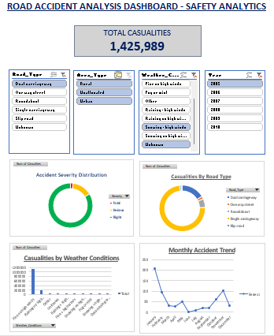

# Road Accident Intelligence Dashboard – Safety Analytics

## Project Overview
This project analyzes road accident data to identify patterns in accident severity, road conditions, and environmental factors. The dashboard was built in Microsoft Excel using Pivot Tables, charts, and interactive slicers to support data-driven safety insights.

## Dataset
The dataset contains 162,019 road accident records including:

- Accident Severity
- Casualties
- Road Type
- Area Type
- Weather Conditions
- Date and Time of Accident

## Tools Used
- Microsoft Excel
- Pivot Tables
- Pivot Charts
- Slicers
- Data Cleaning

## Dashboard Features
The dashboard provides interactive analysis including:

- Accident severity distribution
- Casualties by road type
- Casualties by weather conditions
- Monthly accident trends
- Interactive filters for road type, area type, weather, and year

## Key Insights
- Approximately **81% of casualties were slight injuries**
- Around **2.7% of accidents resulted in fatalities**
- **Single carriageway roads recorded the highest number of accidents**
- Most accidents occurred during **fine weather conditions**, indicating traffic volume as a key factor

## Dashboard Preview

## Project Structure